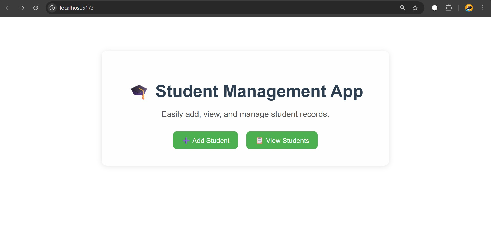
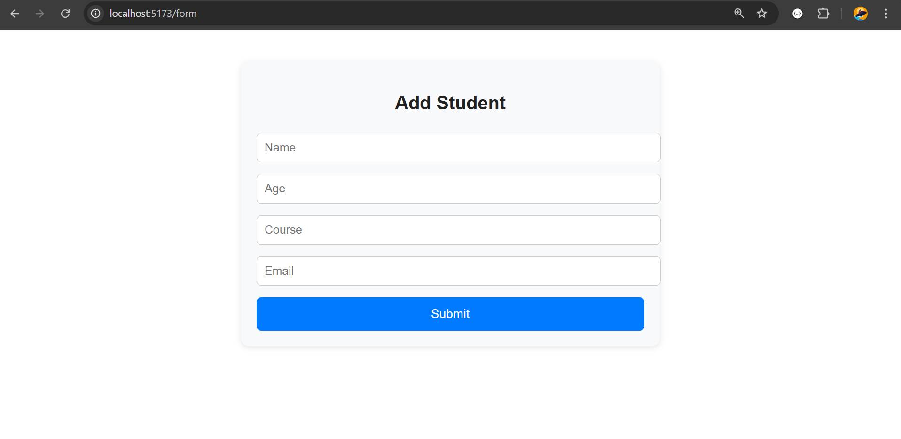
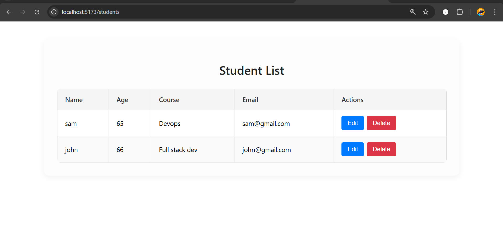

# Student Management Frontend (React.js)

This is the **frontend** for the Student Management Application, built with **React.js**. It allows users to create, update, view, and delete student records through a clean and responsive user interface.

---

## ⚙️ Tech Stack

- React.js
- Axios (for API calls)
- React Hooks (useState, useEffect)
- React Router (if routing is used)
- CSS / Tailwind / Bootstrap (depending on your styling choice)

---

## ✨ Features

- Add a new student
- Edit student details
- Delete student records
- View all students in a table/list
- Clean UI with responsive design

---

## 🧾 Getting Started

### 1. Clone the repository

```bash
git clone https://github.com/sohel3441/Student-Management-App-Frontend.git
cd Student-Management-App-Frontend


2. Install dependencies

npm install

3. Start the development server
npm run dev

App will run at:
http://localhost:5173


## 📷 Screenshots

### 🏠 Home Page


### 🧾 Add Student Form


### 📋 Student List
